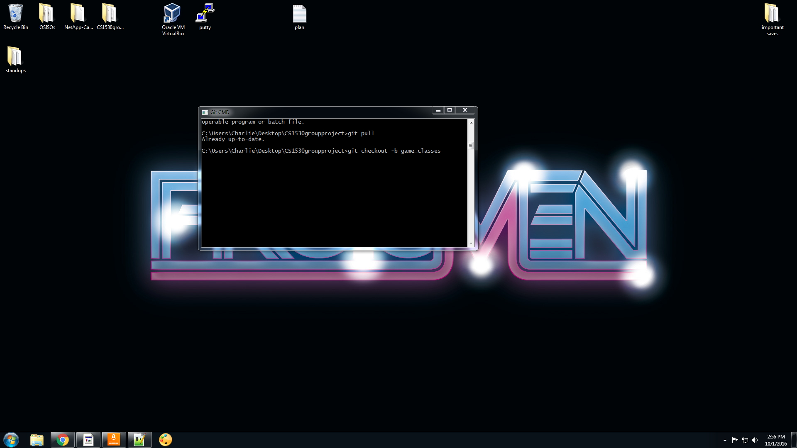

# Branching Plan and Walkthrough!
This is a small branching and integration plan and walkthrough. If you are unfamiliar with using github branches, this guide proved to be helpful: https://github.com/Kunena/Kunena-Forum/wiki/Create-a-new-branch-with-git-and-manage-branches

1. Navigate to your local repository folder from the command line ```cd  path/to/folder/CS1530groupproject```
2. After selecting an appropriately sized feature/user-story, create a branch for that feature from the command line with ```git checkout -b [name_of_your_new_branch]```
	* We want to keep the work done in branches relatively small, so that we can more quickly merge it with the master branch. In doing so, we minimize the amount of merge conflicts to be resolved. 	
	* Moreover, this allows for other team members to develop their own features alongside the most recent changes to the master branch. 
	* Early on, some branches might be rather large as our architecture gets put in place. Thats ok!

3. Using the command ```git branch``` will show which branch you are currently working on. You can use the command ```git checkout [name_of_branch]``` to switch between branches. 
	* When working on a branch, you use ```git add .``` and ```git commit``` as you would normally. The only difference comes when you want to push the changes to remote repository.

4. Whenever you are done working on your feature, or just want to save it to the repository for later, you need to push it to the remote repository (aka "origin" aka the online repo we all look at: https://github.com/clm133/CS1530groupproject ). You can do this with the command ```git push origin [name_of_branch]```

5. If work on your feature/user story is done it is time to make a pull request. Make sure you pushed the most recent changes to the repository and navigate to the repository via a web browser (we no longer need the command line).
6. You should see link in the remote repository to a list of branches. You should see your branch listed (usually under Active branches or Your branches).

7. Beside it, you should also see an option to make a pull request.

8. You have the option to write an overview of what your pull request entails, but its not absolutely necessary. Make sure to use the assignees toggle on the right-hand-side to add your other team members to the pull request.

9. After creating the pull request, let everyone know and let someone else approve the merge. 
	* To approve a merge, just make sure the branch does not break anything and works as intended. Remember, Agile wants working software all the time.
	* If something is discovered to be broken later--don't sweat it-- make another branch, fix the problem, make another pull request.
10. Thats it! Once someone someone approves the merge, your branch has been integrated with the master branch!
